# Mix Check feedback board — 2026-09-02

**This is the operating surface for Kevin's Mix Check feedback.** Every item below has the screenshot
Kevin marked up, what he asked for, who owns it, and its status. Agents work from this. The
coordinator updates it every turn. Kevin checks it instead of repeating himself.

- **Live on `main`: `4bb6f70`, build `2026-09-02.6`** — header re-layout (3+9) + Hope-rail pass (4/5/6/8/10) promoted 2026-09-02, ff-only. Jules design-reviewed the Hope-rail pass = APPROVE (block below).

**Status legend:** `RULE` (standing) · `APPROVED` (Kevin said yes) · `BUILDING` (agent working) ·
`RENDER READY` (built, awaiting Kevin's yes) · `QUEUED` (not started) · `VERIFY` (needs a live check).

---

## ✅ JULES DESIGN REVIEW — 2026-09-02 (Hope-rail pass `2cec7cc`, build `2026-09-02.6`)

**Verdict: APPROVE — ready for Kevin's rendered sign-off. One non-blocking note (item 6).**

Reviewed the FINAL state: branch `hope-rail-pass`, pass commit `2cec7cc` (tip `4bb6f70`).
`git diff origin/main origin/hope-rail-pass -- index.html` = 122 lines, all CSS + the dead
drag-handle removal (markup + `wireAiChatComposeResize`). No behaviour/DSP/voice-wiring change.
Rendered from the committed branch bytes over a local HTTP origin (raw.githack 403 service-wide),
headless Chrome 152, desktop 1680×1300, long `AICHAT.history` injected (14 turns) + empty state +
a real analysed synth WAV for the loaded state. Composite + 9 crops in
`jules` scratchpad (paths in the coordinator hand-back).

| Item | Verdict | Evidence |
|---|---|---|
| **4** — drop Hope block + chat down, wave gets its own band | **PASS** | `.rail-head` padding-top 22→44 (both the base rule and the `@media(min-width:1024px)` mirror); `.rail-body` padding-top 14→30. `#hopeWave` reversed to a reserved band: `display:block;opacity:0` idle → `opacity:1` speaking, `margin-top:22px` identical both states (zero reflow — confirmed). Wordmark untouched (26px, board item 2 — **PASS**). First chat turn top measured **222px** vs centre-banner top **224px** → chat starts level with the yellow line (board 4b). **The +22px (→44px) is the right number** — it is exactly what lands the first turn on the banner line; going higher pushes the chat start out of alignment. Keep 44px. |
| **5** — remove dead drag bar | **PASS** | Markup `#aiChatComposeResize`, `wireAiChatComposeResize()` + its call, and all `.aichat-resize-handle` CSS removed. `getAiChatComposeHeight`/`setAiChatComposeHeight`/`AICHAT_COMPOSE_HEIGHT_KEY` kept for snapshot recall. No dangling reference / console error. Composer textarea sits directly under the last turn — clean. |
| **6** — Clear-chat + Attach-screenshot in the composer row | **PASS (1 non-blocking note)** | `#aiChatClear` un-hidden, styled as an exact mirror of `#aiChatImageBtn` (`#232629` fill, `#2c3034` border, 999px, 11px/600, `9px 10px`), red-tint hover for the destructive action. `#aiChatImageBtn` un-hidden. `#aiChatClearInput` stays hidden. DOM order → visual row **Send \| mic \| speaker \| Attach screenshot \| Clear chat**. **Note:** at ≲380px rail width "Clear chat" wraps to its own full-width line (same `.send-col{flex-wrap:wrap}` behaviour "Attach" always had). It reads as a deliberate secondary action and is not broken — acceptable as graceful degradation on a narrow rail; at wider (resizable) rail widths the row is single-line. If Kevin wants it single-line at all widths, that is a small follow-up for **Cat** (shrink pill padding/font or `flex-wrap:nowrap` + `min-width:0` on the row). Not a merge blocker. |
| **8** — rail must not grow the page | **PASS** | `#hopeRail` `height:0;min-height:100%` resolves against the `grid-row:1/-1` area (confirmed in Chrome). Long transcript: `#aiChatTranscript` scrollH 1740 > clientH 681, scrolls **internally**; composer pinned bottom (`flex:0 0 auto`); `document.scrollHeight == innerHeight` (page did **not** grow). Rail bottom == `#mcSpecs` bottom in every state. Loaded state: `#mcSpecs` = `#mcActions` = `#hopeRail` bottom = **1315**, all flush (matches Markey's CDP). Scrollbar is `scrollbar-width:thin` + 6px webkit thumb `#33383f` → suitably quiet; Kevin may want the thumb one shade lighter if he wants a visible scroll hint, but "minimal/hidden" is what the board asked for. |
| **10** — loaded WAV button matches empty-state gradient | **PASS** | Loaded `.mc-input-main` now `background:var(--grad);color:var(--grad-ink);border:0` — computed `linear-gradient(90deg,#2fa1e6,#a557f4)` + `#0d1211` ink, byte-identical fill to the empty-state "Drop / browse WAV". Only padding stays compact (`6px 11px`). Hover `filter:brightness(1.06)`. |

**3-column bottom-align (`#mcSpecs` = `#mcActions` = `#hopeRail`):** holds — loaded **1315** flush, empty **1214** flush (`#mcActions:empty` is `display:none`, pre-existing). No regression from this pass.

**Console:** clean of pass-related errors. The only console output on my run is environmental (offline `file`/localhost origin: proxy CORS, missing YT_KB index) and would not appear on the hosted site. `[AIMM] build 2026-09-02.6` logs correctly.

**One judgment call for Kevin (not a defect):** the reserved `#hopeWave` band is empty dark space when Hope is not speaking. This is exactly what item 4 asked for ("breathing space for the speech wave", no reflow when she starts talking) — flagging only so Kevin confirms he is happy seeing it as whitespace at rest.

**Recommended next step:** Kevin opens the render / a rendered branch build, approves → coordinator does the single ff-only promote of `hope-rail-pass` to `main` (it is a superset of `51163ed`, so it also carries the approved items 3 + 9). Then Cat picks up item 7, and the item-3 VERIFY check runs.

Item statuses below updated to **RENDER READY (Jules-reviewed)**.

---

## ⏹ SESSION END — 2026-09-02 (switching to main account) — READ THIS FIRST ON RESUME

**Live on `main` @ `4bb6f70`, build `2026-09-02.6`.** Promoted this session (Kevin ran the ff-only): header re-layout (items 3, 9) + Hope-rail pass (items 4, 5, 6, 8, 10). Jules design-reviewed the Hope-rail pass -> APPROVE (full block below). No agents running.

**DONE / LIVE:** items 1, 2, 3, 4, 5, 6, 8, 9, 10 (as built — gradient on the compact loader).

**OPEN — one Cat batch, off `main` @ `4bb6f70`, one branch, next build `2026-09-02.7`:**
- **7** — Fix Queue frequency bar: broadband fixes draw NO band; band fills solid clear, not the low-alpha brown wash.
- **10 REVISED** (Kevin, after seeing the render): remove the compact "Load WAV" form entirely. Keep the FULL "Drop / browse WAV" button (full size + gradient + the "browse file · live input · capture tab" caption) in the transport-bar position from item 3, in BOTH states. Gradient is already done; this is size/label — no shrink to "Load WAV".
- **12** — the last chat bubble is clipped at the transcript's bottom edge (fades out mid-sentence, no scrollbar). Likely tied to item 8's overflow change — transcript not auto-scrolling the newest turn fully into view, or missing bottom padding. Cat.
- **13** — add a HORIZONTAL volume slider to the transport control row, next to play / rewind / forward / stop — controls the loaded track's playback level. Jules specs placement + style (new component); Cat implements + wires it to the playback gain node.
- **item-3 VERIFY** — on build .6, does Hope still name "Session Snapshot / Repair tab / Insight tab" for "about fix #02"? Clear the chat (AICHAT_HISTORY_KEY), analyse a FRESH track, ask about a fix — confirm she answers directly, no retired surface. Likely stale cached chat, unconfirmed.

**RESUME:** Jules specs item 13 placement -> dispatch Cat for 7 + 10-revised + 12 + 13 on one branch off `main` -> render (real app, long transcript + a broadband fix in the queue) -> Kevin approves -> ff-only promote -> run the item-3 VERIFY.

**Non-blocking notes from Jules's review** (Kevin's call, not defects): item 6 — "Clear chat" wraps to its own line at <=380px rail width (fine as graceful degradation; Cat can force single-line if wanted). Item 4 — the `#hopeWave` band is empty dark space at rest (that's the requested breathing room).

**Standing process (agreed 2026-09-02, in `agent-commons/SESSION_PROTOCOL.md` §8):** one board = operating surface · batch feedback · pictures both ways · one ask per message · real-app render -> Kevin approves -> one branch -> Kevin promotes with a cd-prefixed PowerShell block · never a wireframe. **Scope is a hard boundary** — an agent handed out-of-scope work hands it back and names the right owner. Jules specs AIMM layout/CSS, Cat implements, Markey only voice/chat wiring. Kevin's screenshots live in his ShareX Screenshots folder (per-month). Board mirrored to the Desktop file `Mix Check Feedback Board.html`.

---

## Context — why the live site looked wrong mid-session

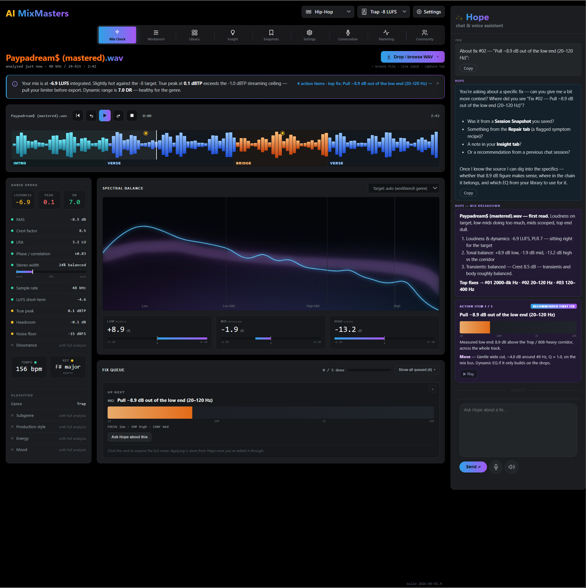

Screenshot `00` (Kevin: *"why are we going backwards"*). This was **build `2026-09-01.9`** — the
`git push origin main` had not landed yet (wrong directory). Everything here (fake INTRO/VERSE
labels, `.wav` in the header, Hope asking about a "Session Snapshot", the MIX BREAKDOWN card,
HIGH −13.2) is the *pre-fix* build. After the push landed, `main` = `2026-09-02.4` with all 9
fixes. Not a regression — a missed push.

---

## The list

### 1 — No wireframes. `RULE`

Kevin opened the grey Jules wireframe and: *"This is the worst… I'm losing the will to live."*
**Every proposal from here is rendered from the real app** (branch + raw.githack + screenshot),
never a paper prototype. Wireframe review is off.

### 2 — Hope rail header look — keep it. `APPROVED`

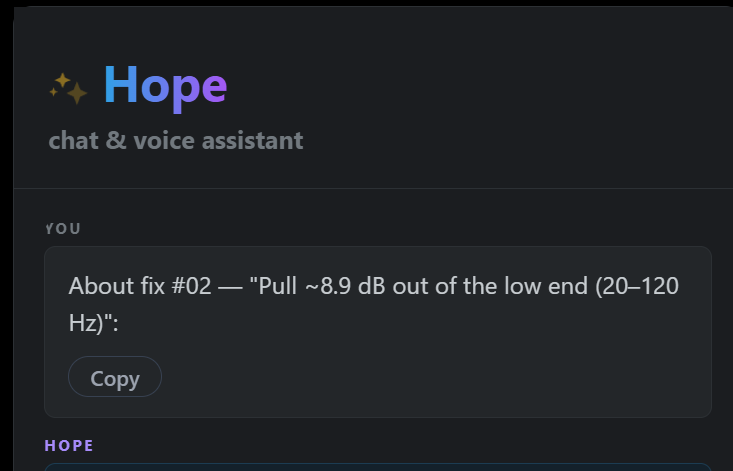

*"I want this."* The shipped Hope identity treatment (✨ stars, "Hope" blue→purple wordmark,
"chat & voice assistant", the `#hopeWave` gradient bars) is signed off. Do not restyle it.

### 3 — Header re-layout. `LIVE` (promoted `4bb6f70`, build 2026-09-02.6) — Cat

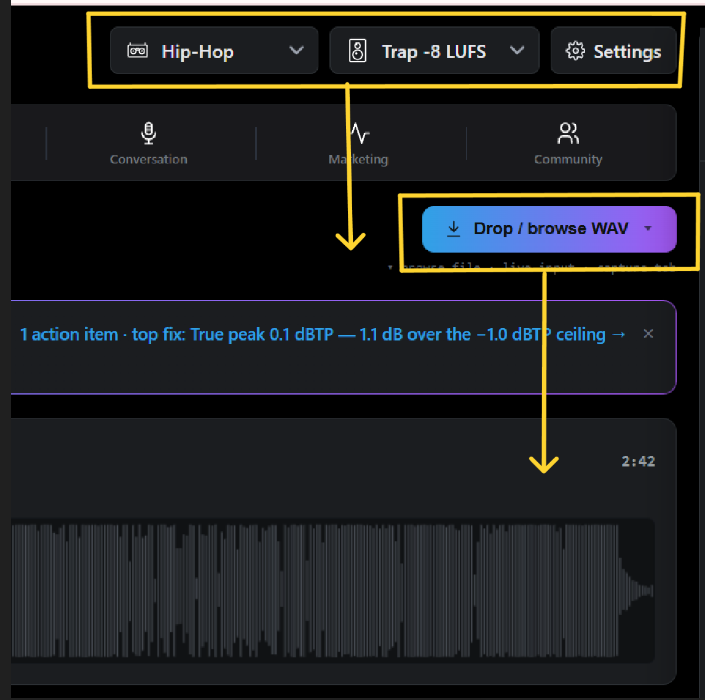

Move the **`Hip-Hop / Trap ‑8 LUFS / Settings`** cluster **down** onto the file-title row (right
side). Move **`Drop / browse WAV`** **into the transport bar**. (Earlier take: `03-header-relayout-early.png`.)

- Built on `mixcheck-header-relayout` (`51163ed`, build `2026-09-02.5`). Mix-Check-scoped — other
  8 tabs unchanged. Empty state: the transport card is the drop zone so the loader is always reachable.
- **Kevin approved 2026-09-02.** Promote HELD so it lands together with the Markey pass + item 10.

### 10 — WAV-loader button. `LIVE` (gradient) + `QUEUED` REVISION — Cat

**Gradient: LIVE** (`4bb6f70`). **REVISION (Kevin 2026-09-02):** drop the compact "Load WAV" form — keep the FULL "Drop / browse WAV" button (full size, gradient, caption) in the transport-bar position, BOTH states. -> Cat batch.

<!-- original item 10 note: -->

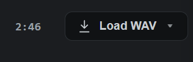

Cat's loaded-state loader (`Load WAV ▾`, compact, in the transport row) renders **plain dark** —
the empty-state one is the **blue→purple gradient** `Drop / browse WAV`. Kevin: the gradient
treatment must stay after a file is dropped. Compact size is fine in the loaded state; the
fill/gradient/style must match the empty-state button.

### 4 — "Hope's domain" — drop Hope down, drop the chat down. `LIVE` (promoted `4bb6f70`; Jules PASS, 44px is right) — Markey

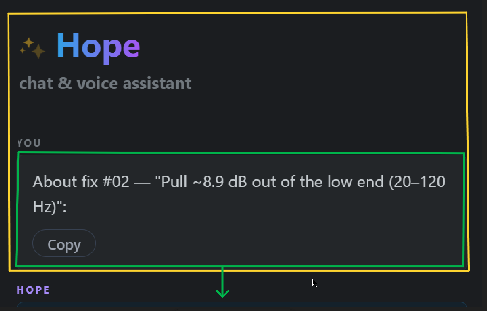 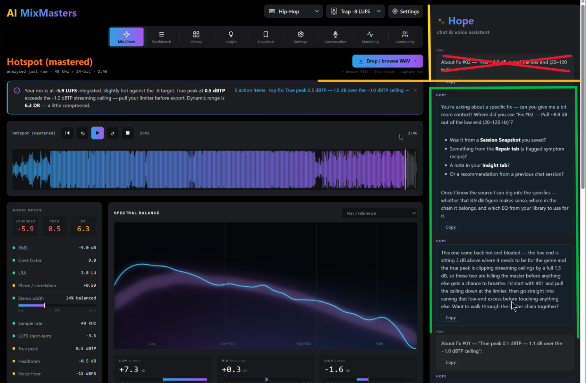 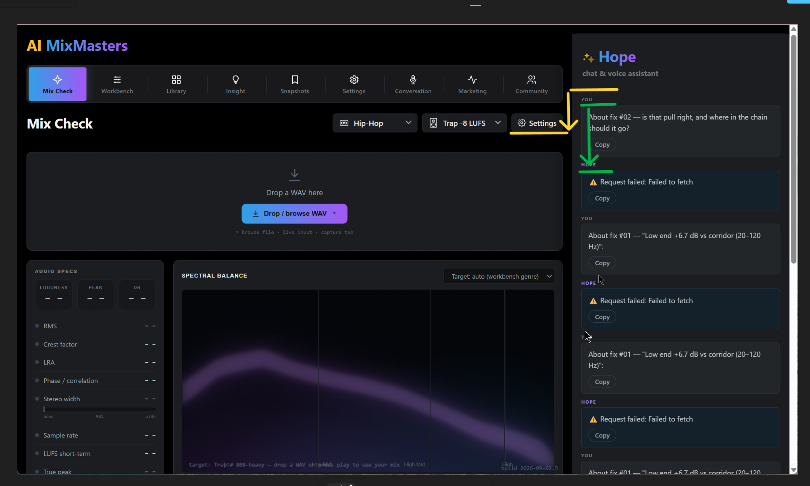

The whole Hope identity zone (stars, name, subtitle, **speech wave**) is **"Hope's domain"**.

**It is whitespace, not font size** (Kevin, screenshot `04c`: *"this is the room to breathe — not
the text/font/name"*). Three moves:
- **Drop the Hope block down** off the top edge — vertical space *above* "Hope" so it isn't jammed
  against the rail top.
- **Drop the chat down** — a clear gap *between* the Hope block and the first message; the
  conversation starts lower.
- The gap that opens is **room for the `#hopeWave` speech wave** — it gets its own clear band
  between the "chat & voice assistant" subtitle and the first chat turn, not crushed against the
  transcript (Kevin: *"then we will have breathing space for the speech wave"*).
- Do **not** enlarge the "Hope" wordmark or pad tight around it — the name treatment is locked (item 2).

Alignment (screenshot `04b`): the chat's start aligns to the **yellow line** — level with the top
of the centre banner, i.e. just below the header controls row. Nothing from the chat appears above
that line (the top "YOU / About fix #02" turn — red X — should not be up in Hope's zone).

### 5 — Remove the dead drag bar. `LIVE` (promoted `4bb6f70`; Jules PASS) — Markey

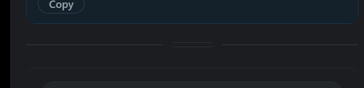

The transcript↔composer drag handle (`trapMasterAiChatComposeHeight_v1`) does nothing in the rail
layout. Remove it.

### 6 — Composer: add Clear-chat + Upload-screenshot buttons. `LIVE` (promoted `4bb6f70`; Jules PASS; narrow-rail wrap = Kevin's call) — Markey

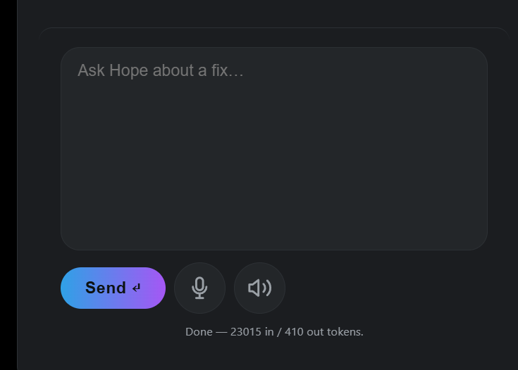

Add a **Clear chat** button (new) and an **Upload screenshot** button to the composer row.
The screenshot button is a **restore** — `#aiChatImageBtn` (drag/drop/paste, vision-aware send)
exists but was hidden in the R3 strip pass. Un-hide it and place it in the composer row.

### 7 — Fix Queue frequency bar: the brown wash. `QUEUED` — Cat (after #3)

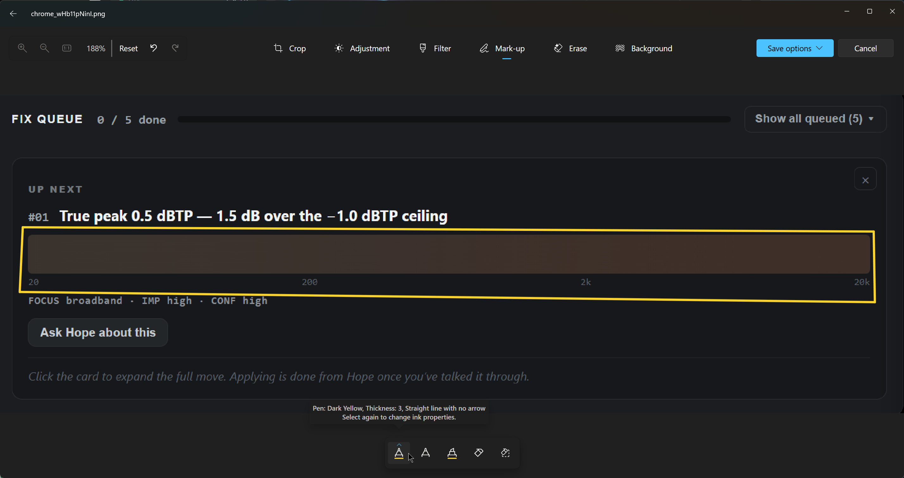

Item `#01` is a **broadband** fix (`FOCUS broadband`) — no frequency range — so the band graphic
renders an empty full-width wash. The **brown** is orange (`#f97316`) at low opacity over the dark
card; brown isn't in the palette. Fix: broadband items draw **no** frequency band (or a broadband
indicator); band items get a **solid clear** fill, not a low-alpha wash.

### 8 — Rail must not grow the page. `LIVE` (promoted `4bb6f70`; Jules PASS) — Markey

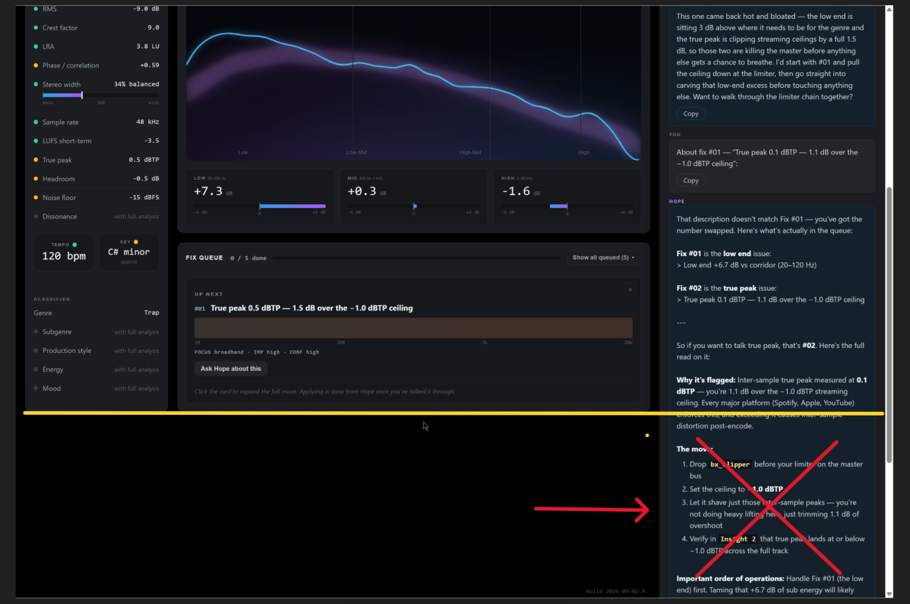

The Hope rail is growing the whole document — a long transcript pushes the dashboard out of view.
Rail is **height-locked to the dashboard** (the yellow line = the centre column's bottom). Long
transcripts **scroll inside the transcript area** with a minimal/hidden scrollbar. The page never
extends past the dashboard. (Pairs with #4 — same boundary.)

### 9 — Tab strip: fill the whole row, no gap. `LIVE` (promoted `4bb6f70`) — Cat

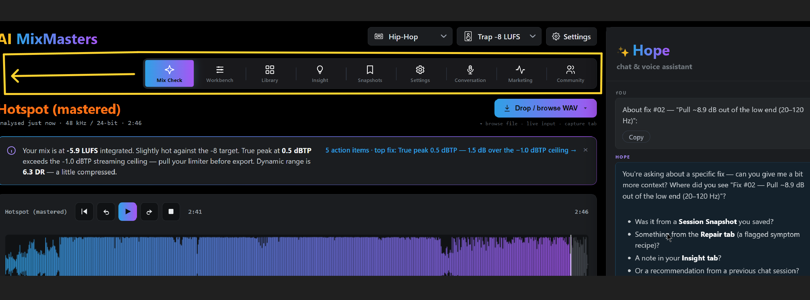

The strip stops short of the right edge. It must **fill the row edge-to-edge**, right end aligned
with the panel grid below it, **zero trailing gap**. Tabs can be larger to fill it. (Earlier take
on the review artifact: `09-tabstrip-early.png`.)

- Done in the `mixcheck-header-relayout` branch: indent rule deleted, taller padding, container
  spans the full column, `flex:1 1 0` tabs fill it. CDP-measured: strip right edge = analyser grid
  right edge (1020px), no gap. **Verify in Kevin's render.**

---

### 12 — Last chat bubble is clipped. `QUEUED` — Cat

The newest message in Hope's transcript is cut off at the bottom edge of the scroll region — fades out mid-sentence, no scrollbar in the bubble. Kevin flagged it twice (consistent). Likely tied to item 8's overflow change: transcript not auto-scrolling the newest turn fully into view, or missing bottom padding on the scroll region. Bundle with 7 / 10-revised / 13.

### 13 — Horizontal volume slider in the transport row. `SPEC READY` — Jules (spec done) + Cat (build)

Add a HORIZONTAL volume slider to the transport control row, next to play / rewind / forward / stop. Controls the loaded track's playback level. New component — Jules specs placement + style, Cat implements and wires it to the playback gain node.

**Jules spec — `docs/design/13-volume-slider-spec.md` (this branch).** Key decisions:

- **Placement:** new `.tp-vol` wrapper inside `.ref-transport`, immediately **after `.tp-btns`
  (after the stop button), before `#refTimeElapsed`** — i.e. in the left control cluster, left of
  `#refTimeDuration`'s `margin-left:auto` so the timecodes + loader stay pinned right. Lives inside
  `#refDzLoaded`, so it simply does not exist until a WAV is loaded — no disabled/placeholder state.
- **Form:** speaker glyph (14×14 inline SVG, `stroke:var(--muted)`, one arc, non-interactive) +
  8px gap + `<input type=range>` — groove **88px × 6px**, `border-radius:3px`, unfilled
  `var(--inset2)`, filled portion `var(--grad)` (full blue→purple across the track, revealed
  left→right — matches `.mcq-prog .track i` / `#mcWave`). Thumb **12px** `#f2f4f5` circle,
  `box-shadow:0 1px 2px rgba(0,0,0,.5)`; `:focus-visible` → `outline:2px solid var(--accent-a)`.
  Wrapper capped at 32px height (= `.tp-btns` height), `flex-shrink:0`, `nowrap`. No %/dB text
  (aria only).
- **Behaviour:** range 0–100 %, **default 100** (unity). Taper = **logarithmic / dB**:
  `x=value/100`; `gain = x<=0 ? 0 : 10^(-2*(1-x))` → 0 dB @100, −20 dB @50, silence @0 (≈40 dB
  range). Apply via `gain.setTargetAtTime(target, ctx.currentTime, 0.02)`. **Persist** across the
  session — `localStorage` `MC_PLAYBACK_VOL_KEY = 'aimm_mc_playback_vol_v1'`, restore on load, apply
  when a track loads.
- **Wiring (Cat):** drives the **playback monitor GainNode only** — must be **downstream of every
  analysis tap**. Meters / analyser / LUFS / `#mcWave` peaks all read the decoded buffer or a
  pre-gain tap; moving this slider must not move any meter or the waveform. Confirm analysis nodes
  are tapped before this gain node.
- **Reflow:** none at normal width (row uses ≈600–750px of ≈990px, stays single-line). `#mcWave`
  canvas is a **separate fixed-height sibling** of `.ref-transport` — cannot be resized or redrawn
  by adding a row child; LOCKED rendering safe. At very narrow (resizable) centre-column widths
  `.tp-vol` wraps as one unit to a second line, shifting `.mc-wave-box` **down** ≈44px (vertical
  only, no redraw) — same graceful degradation the compact loader already shows. No blocker.

## Question (answered — not an action)

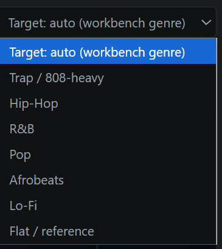

*"How has this been researched?"* — The corridors are computed from **Elowsson & Friberg 2017**
(measured LTAS of 12,345 commercial masters, BS.1770‑4), corroborated by **Pestana et al. 2013**
(772 #1 singles) + cited practitioner references; iZotope Tonal Balance Control informs the model
only (no numeric curve published). Full write-up: `docs/corridor-retune-spec.md` on `main`.
One parameter still needs Kevin's ear — **low-band elevation for bass genres** (test in §6: load
3–5 trusted trap masters, Target = Trap, average the LOW meter).

---

## VERIFY — item 3 (Hope awareness) on the live build

Screenshot `08` is build **`2026-09-02.4`** (the fixes) and Hope **still** replies *"Was it from a
Session Snapshot / the Repair tab / your Insight tab?"* to "about fix #02". Either the fix isn't
working live, or that's **persisted chat history** (`AICHAT_HISTORY_KEY`, last 50 messages) shown
after a reload. **Needs a clean check:** clear the chat, analyse a fresh track, ask Hope about a
fix — confirm she answers directly and names no retired surface. Until then item 3's live status is
unconfirmed.

---

## Sequencing

1. **Cat — now:** #3 + #9 render ready → Kevin approves → ff-only promote (`git merge --ff-only 51163ed`).
2. **Cat — next:** #7 (Fix Queue bar), own branch off updated `main`.
3. **Markey — after #3 lands:** #4, #5, #6, #8 in one Hope-rail pass → render → Kevin approves → promote.
4. **Coordinator — parallel:** the item‑3 VERIFY check.
- Nothing reaches `main` without Kevin's explicit approval on a real-app render.